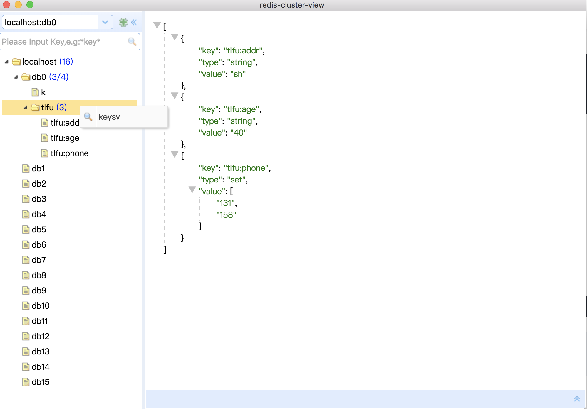
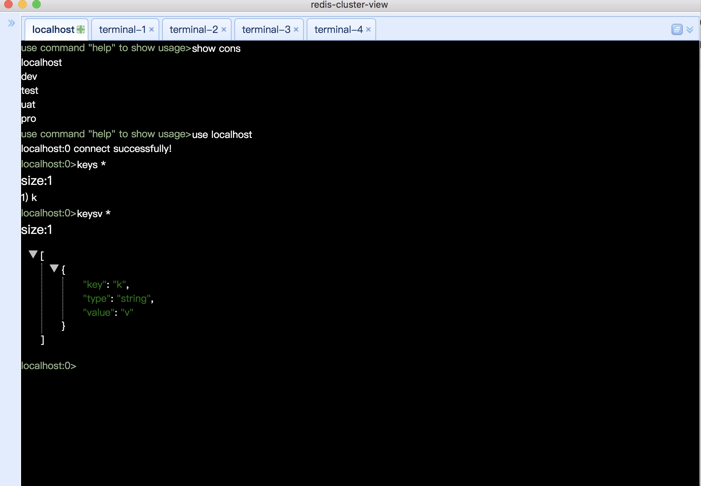
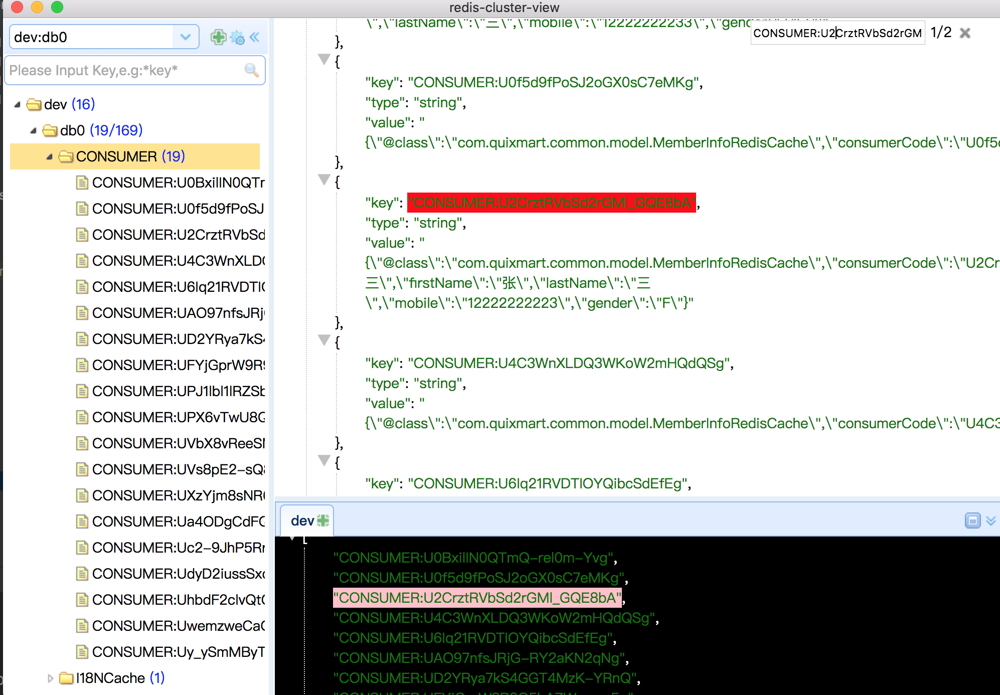

# redis-cluster-view
## 开发背景

目前主流的client多多少少有以下缺点：

- terminal对集群支持不好，像模糊查询只能查询一个节点
- terminal 切换环境比较慢，不支持多环境显示
- 没有批量模糊删除功能
- 没有批量导出功能
- 没有批量查询value功能

1.UI只提供简单的查询，并且只展示部分key(默认10000，每个分组为1000)，可以用模糊查询去找相关的key集合。推荐使用terminal,同时也熟悉redis的命令，注意：terminal是查所有的值. 
           
2.keys命令是用scan实现，自定义keysc和keysv命令，keysv命令是用scan和pipeline实现. 
           
3.terminal支持模糊删除，如：del \*key*,单机模式用lua+keys实现，集群用scan+pipeline实现 
           
4.双击terminal头部，光标滚动到最底部，方便数据量大时展示快速继续输入命令 
           
5.ctrl+f 搜索关键字 enter查找下一个，ctrl+l查找上一个 
           

6.欢迎提宝贵意见:qq群号:942050383  

## run
npm install

npm start

## package
npm run package-mac

npm run package-win

npm run package-linux

Each platform can only have its own package

## app download 
version:1.1.0
链接: https://pan.baidu.com/s/1gERNGz-Ght37BJmUMGjE9A 提取码: 9nej
qq群号:942050383

## License
MIT