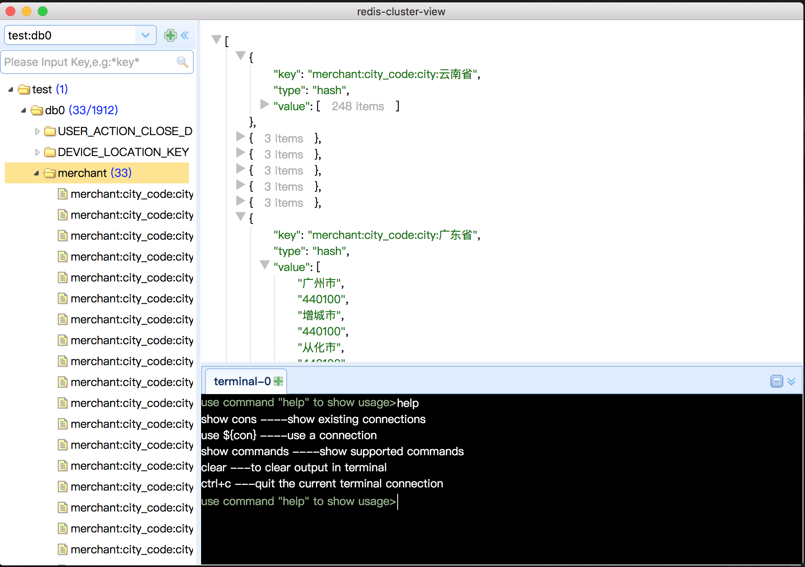

# redis-cluster-view

## run
npm install

npm start

## package
npm run package (默认打dmg，修改package.json中package即可，--mac;--win;--linux)

Each platform can only have its own package

## download
see release-package dir
